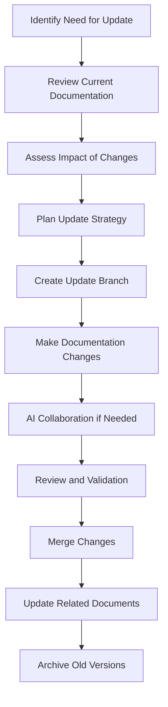
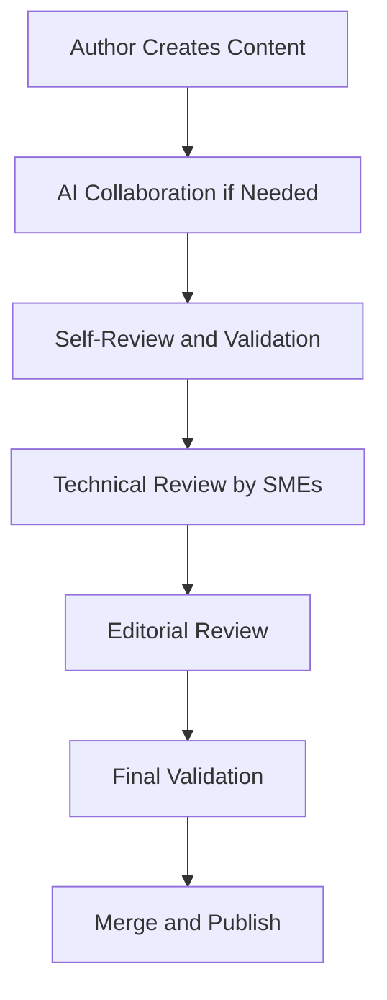

# NextChat SillyTavern Integration Documentation Guide

## Overview

This guide provides comprehensive instructions for using, maintaining, and updating the NextChat SillyTavern integration documentation system. It establishes standards for documentation quality, update procedures, AI collaboration practices, and maintenance workflows to ensure the documentation remains accurate, consistent, and valuable for the development team.

## Documentation Structure

### File Organization

#### Root Level Documentation
```
/
├── ROADMAP.md           # Project roadmap and milestones
├── SPEC.md             # Technical specifications and requirements
├── ARCHITECTURE.md     # System architecture and design
├── API.md              # API documentation and interfaces
├── DEVELOPMENT.md      # Development standards and processes
└── README.md           # Project overview and setup
```

#### Specialized Documentation
```
docs/
├── DOCUMENTATION_GUIDE.md    # This file - documentation maintenance
├── user-manual-*.md         # End-user documentation
├── faq-*.md                 # Frequently asked questions
├── cloudflare-pages-*.md    # Deployment guides
└── images/                  # Documentation assets
```

### Documentation Categories

#### Strategic Documentation
- **ROADMAP.md**: High-level project direction, phases, and timelines
- **SPEC.md**: Detailed technical requirements and specifications
- **ARCHITECTURE.md**: System design and component relationships

#### Technical Documentation
- **API.md**: API endpoints, data structures, and integration guides
- **DEVELOPMENT.md**: Development processes, standards, and best practices

#### User-Facing Documentation
- **README.md**: Project introduction and initial setup
- **docs/user-manual-*.md**: User guides and tutorials
- **docs/faq-*.md**: Common questions and troubleshooting

## Update Procedures

### Documentation Update Workflow

#### 1. Planning Updates


#### 2. Making Updates

##### Minor Updates (Typos, Clarifications)
1. Create a feature branch: `git checkout -b docs/minor-fixes`
2. Make targeted changes to specific files
3. Test documentation links and references
4. Create pull request with clear description
5. Request review from technical writer or maintainer

##### Major Updates (New Features, Architecture Changes)
1. Create feature branch: `git checkout -b docs/feature-x-documentation`
2. Update all affected documentation files
3. Ensure consistency across all documents
4. Add examples and code snippets where relevant
5. Update cross-references and navigation
6. Create comprehensive pull request with change summary

#### 3. Update Checklist
- [ ] **Accuracy**: Information is factually correct and up-to-date
- [ ] **Clarity**: Content is clear and easy to understand
- [ ] **Consistency**: Terminology and formatting are consistent
- [ ] **Completeness**: All necessary information is included
- [ ] **Navigation**: Cross-references and links work correctly
- [ ] **Examples**: Practical examples provided where helpful
- [ ] **Validation**: Technical content validated by subject matter experts

### Cross-Reference Management

#### Internal References
When referencing other documentation files, use relative links:

```markdown
[See API documentation](./API.md) for detailed endpoint information.

[Character management architecture](../../ARCHITECTURE.md#character-management) describes the component design.

[Development setup instructions](../DEVELOPMENT.md#environment-setup) provide detailed installation steps.
```

#### External References
For external resources, use descriptive links with context:

```markdown
[Next.js App Router documentation](https://nextjs.org/docs/app) provides comprehensive routing guidance.

[React Testing Library best practices](https://testing-library.com/docs/react-testing-library/intro/) ensure accessible component testing.
```

## AI Collaboration Guidelines

### Working with AI for Documentation

#### When to Use AI Assistance
- **Content Generation**: Creating first drafts of new documentation sections
- **Content Improvement**: Enhancing clarity and readability of existing content
- **Example Creation**: Generating code examples and usage scenarios
- **Consistency Checking**: Ensuring consistent terminology and formatting
- **Translation**: Creating multi-language versions of documentation

#### AI Collaboration Best Practices

##### 1. Provide Context
```markdown
<!-- When requesting documentation updates -->

"Based on our existing documentation structure:

- ROADMAP.md defines project phases and milestones
- ARCHITECTURE.md describes system components
- API.md documents interfaces and endpoints
- DEVELOPMENT.md covers development processes

Please help me document the new character memory management feature, ensuring consistency with existing patterns."
```

##### 2. Specify Requirements Clearly
```markdown
<!-- Clear requirements for AI assistance -->

"I need to document the character memory management system:

**Requirements:**
- Explain the memory storage architecture
- Document the API endpoints for memory operations
- Provide code examples for memory integration
- Include performance considerations
- Add troubleshooting information

**Style Guidelines:**
- Use the same technical level as existing docs
- Include TypeScript examples
- Follow the code snippet format used in API.md
- Maintain consistency with other architecture documentation"
```

##### 3. Iterative Refinement
```markdown
<!-- Iterative approach to documentation -->

**Initial Request:** "Create a new section for memory management in ARCHITECTURE.md"

**Follow-up:** "The memory management section looks good, but I need to:
1. Add more detail about the caching strategy
2. Include a sequence diagram showing the data flow
3. Add performance benchmarks and considerations
4. Ensure consistency with the API.md memory endpoints"

**Final Review:** "Please review the complete memory management documentation across all files for consistency and accuracy."
```

### AI Documentation Standards

#### Content Quality Standards
- **Technical Accuracy**: All technical information must be verified
- **Clarity**: Complex concepts explained with clear examples
- **Completeness**: All necessary information included for implementation
- **Consistency**: Uniform terminology and formatting across all files

#### Code Examples
```typescript
// ✅ Good: Complete, well-documented example
/**
 * Example: Character memory management integration
 * This example shows how to implement memory operations in a React component
 */
const useCharacterMemory = (characterId: string) => {
  const [memories, setMemories] = useState<CharacterMemory[]>([]);
  const [loading, setLoading] = useState(false);

  const loadMemories = useCallback(async () => {
    setLoading(true);
    try {
      const response = await fetch(`/api/characters/${characterId}/memory`);
      const data = await response.json();
      setMemories(data.memories);
    } catch (error) {
      console.error('Failed to load character memories:', error);
    } finally {
      setLoading(false);
    }
  }, [characterId]);

  return { memories, loading, loadMemories };
};
```

#### Documentation Structure Templates

##### New Feature Documentation Template
```markdown
# [Feature Name]

## Overview
Brief description of the feature and its purpose.

## Architecture
How the feature fits into the overall system architecture.

### Components
- Component 1: Description and responsibilities
- Component 2: Description and responsibilities

### Data Flow
Description of how data flows through the feature components.

## API Reference
API endpoints and interfaces for the feature.

### Endpoints
- `GET /api/feature` - Description of endpoint
- `POST /api/feature` - Description of endpoint

## Implementation Guide
Step-by-step guide for implementing the feature.

### Prerequisites
List of prerequisites and dependencies.

### Setup Steps
1. Step 1
2. Step 2
3. Step 3

## Configuration
Configuration options and settings.

## Testing
Testing strategies and examples.

## Troubleshooting
Common issues and solutions.
```

## Quality Standards

### Content Quality Criteria

#### Clarity and Readability
- **Target Audience**: Documentation matches the technical level of intended readers
- **Structure**: Logical flow with clear headings and subheadings
- **Language**: Clear, concise, and professional language
- **Examples**: Practical examples that illustrate key concepts

#### Technical Accuracy
- **Up-to-date Information**: Regular reviews to ensure current accuracy
- **Technical Precision**: Correct use of technical terms and concepts
- **Code Examples**: Working examples that compile and run correctly
- **API Documentation**: Accurate endpoint descriptions and parameter definitions

#### Consistency Standards
- **Terminology**: Consistent use of technical terms across all documents
- **Formatting**: Uniform markdown formatting and code style
- **Cross-references**: Consistent internal linking patterns
- **Version Information**: Clear indication of document versions and update dates

### Documentation Metrics

#### Quality Metrics
- **Completeness Score**: Percentage of required information present
- **Accuracy Score**: Verified technical accuracy of content
- **Clarity Score**: Readability and understandability assessment
- **Consistency Score**: Uniformity across all documentation files

#### Maintenance Metrics
- **Update Frequency**: How often documentation is updated
- **Issue Resolution Time**: Time to address reported documentation issues
- **User Feedback Score**: User satisfaction with documentation quality

## Maintenance Schedule

### Regular Review Cycle

#### Weekly Reviews
- **Quick Scan**: Check for obvious errors or outdated information
- **Link Validation**: Verify all internal and external links work
- **Screenshot Updates**: Update outdated images or screenshots
- **Feedback Review**: Address user-reported issues

#### Monthly Reviews
- **Content Audit**: Comprehensive review of documentation completeness
- **Technical Validation**: Verify technical accuracy with development team
- **Consistency Check**: Ensure uniform style and terminology
- **Gap Analysis**: Identify missing or inadequate documentation

#### Quarterly Reviews
- **Architecture Alignment**: Ensure documentation reflects current system architecture
- **Feature Parity**: Verify all features are properly documented
- **User Experience**: Assess documentation from user perspective
- **Maintenance Planning**: Plan major documentation improvements

### Update Triggers

#### Automatic Triggers
- **Code Changes**: Documentation updates triggered by code modifications
- **API Changes**: Automatic alerts for API endpoint modifications
- **Architecture Changes**: Notifications for significant architectural updates

#### Manual Triggers
- **Feature Releases**: Documentation updates for new feature releases
- **User Feedback**: Documentation improvements based on user input
- **Technical Debt**: Addressing identified documentation gaps
- **Compliance Requirements**: Updates required for regulatory compliance

## Review Processes

### Documentation Review Workflow

#### 1. Content Creation


#### 2. Review Responsibilities

##### Subject Matter Experts (SMEs)
- **Technical Accuracy**: Verify correctness of technical content
- **Implementation Guidance**: Ensure practical implementation advice
- **Architecture Alignment**: Confirm alignment with system architecture
- **API Documentation**: Validate endpoint and parameter descriptions

##### Technical Writers
- **Clarity**: Ensure content is clear and understandable
- **Consistency**: Maintain consistent style and terminology
- **Completeness**: Verify all necessary information is included
- **User Experience**: Ensure good user experience in documentation

##### Peer Reviewers
- **Practical Validation**: Test code examples and procedures
- **Cross-reference Verification**: Check links and references
- **Feedback Integration**: Incorporate user feedback and suggestions
- **Quality Assurance**: General quality and completeness checks

### Review Checklist

#### Technical Review
- [ ] **Technical Accuracy**: All technical information is correct
- [ ] **Code Examples**: Examples compile and run correctly
- [ ] **API Documentation**: Endpoints and parameters accurately described
- [ ] **Architecture References**: Correct references to system components
- [ ] **Implementation Guidance**: Practical and actionable advice

#### Editorial Review
- [ ] **Clarity**: Content is clear and easy to understand
- [ ] **Consistency**: Uniform style and terminology throughout
- [ ] **Grammar and Spelling**: No grammatical or spelling errors
- [ ] **Formatting**: Consistent markdown formatting
- [ ] **Readability**: Good flow and logical structure

#### User Experience Review
- [ ] **Navigation**: Easy to find required information
- [ ] **Examples**: Sufficient practical examples provided
- [ ] **Troubleshooting**: Helpful troubleshooting guidance included
- [ ] **Getting Started**: Clear path for new users
- [ ] **Reference**: Easy to use as reference material

## Future Considerations

### Documentation Evolution

#### Advanced Documentation Features
- **Interactive Documentation**: Embedded code playgrounds and examples
- **AI-Powered Search**: Intelligent documentation search and recommendations
- **Dynamic Content**: Auto-updating content based on code changes
- **Collaborative Editing**: Real-time collaborative documentation editing

#### Documentation Analytics
- **Usage Tracking**: Monitor which documentation sections are most accessed
- **Search Analytics**: Analyze common search patterns and information needs
- **User Feedback**: Collect and analyze user feedback on documentation quality
- **Gap Identification**: Use analytics to identify undocumented areas

### Documentation Tools and Automation

#### Recommended Tools
- **Markdown Editors**: VS Code with markdown extensions, Typora, Mark Text
- **Documentation Platforms**: GitBook, Notion, Confluence
- **Diagram Tools**: Draw.io, Lucidchart, PlantUML
- **Code Example Testing**: CodeSandbox, Replit for live examples

#### Automation Opportunities
- **Link Checking**: Automated validation of internal and external links
- **Code Example Validation**: Automated testing of code snippets
- **Format Consistency**: Automated formatting and style checking
- **Update Notifications**: Automated alerts for documentation updates

### Documentation Team Growth

#### Team Structure
- **Documentation Lead**: Overall documentation strategy and quality
- **Technical Writers**: Content creation and maintenance
- **Developer Advocates**: Bridge between development and documentation
- **Community Contributors**: External contributors for user-facing documentation

#### Training and Development
- **Documentation Skills Training**: Regular training on documentation best practices
- **Technical Writing Workshops**: Improve technical writing skills
- **Tool Training**: Training on documentation tools and platforms
- **Review Process Training**: Ensure consistent review processes

---

*This documentation guide ensures the NextChat SillyTavern integration documentation remains a valuable, accurate, and well-maintained resource for the entire development team and user community.*